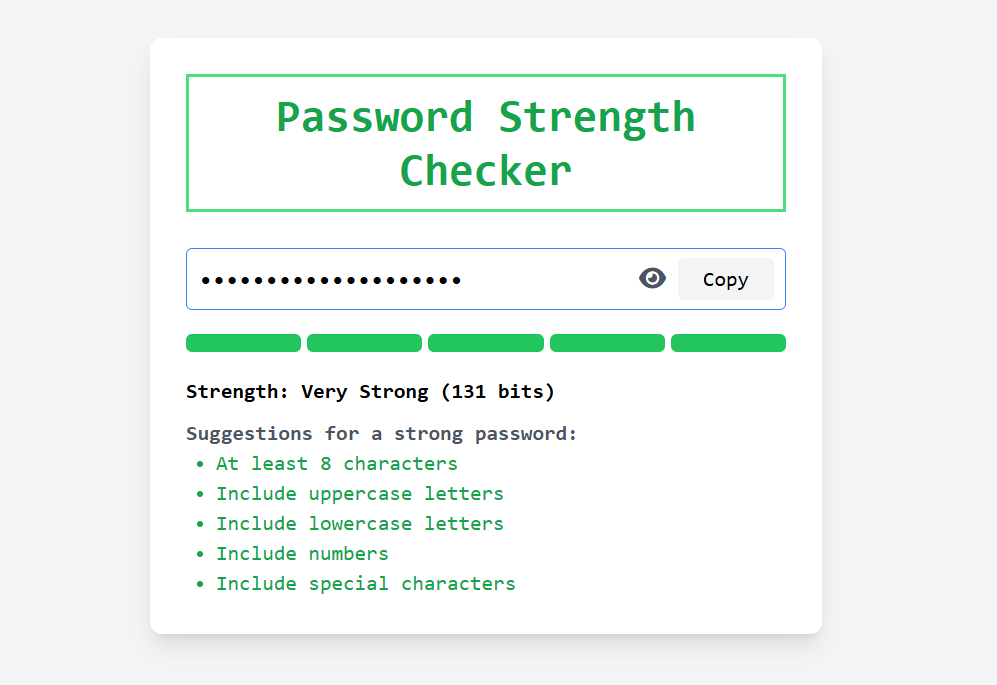

# Password Strength Checker

## Overview
The **Password Strength Checker** is a web-based tool built with **HTML**, **Tailwind CSS**, **JavaScript**, and **Font Awesome**. It allows users to input a password and receive real-time feedback on its strength based on length, character types (uppercase, lowercase, numbers, special characters), entropy, and a common password blacklist.  

The tool features a responsive UI with a password visibility toggle, a copy-to-clipboard button, and visual strength indicators.

---

## Features

- **Live Password Strength Feedback**  
  Evaluates password strength as the user types based on:
  - Length (≥8 characters)
  - Uppercase letters
  - Lowercase letters
  - Numbers
  - Special characters

- **Entropy Calculation**  
  Computes password entropy in bits to provide a more precise strength metric.

- **Common Password Blacklist**  
  Checks if the password is among commonly used passwords (loaded from `assets/most-common-passwords.txt`).

- **Visual Strength Meter**  
  Displays strength using a 5-bar meter with color-coded levels (Weak → Very Strong).

- **Password Visibility Toggle**  
  Allows users to toggle between showing and hiding the password using Font Awesome icons.

- **Copy to Clipboard**  
  Copies the password to the clipboard with visual feedback (success or error).

- **Suggestions**  
  Provides actionable suggestions to improve password strength.

- **Responsive Design**  
  Built with Tailwind CSS for a clean, mobile-friendly UI.

- **Accessibility**  
  Includes ARIA attributes for screen reader support (e.g., `aria-live`, `aria-label`).

---

## Screenshots Demo

1. **Initial State**  
   UI with no password entered; strength meter grayed out and "Enter a password" message displayed.
   
3. **Weak Password**  
   Shows a weak password (e.g., "passwod") with one bar filled in red and suggestions highlighted in gray except for lowercase letters.
   
5. **Strong Password**  
   Displays a strong password (e.g., "Passw0rd!2023") with four bars filled in light green and most suggestions highlighted in green.
   
7. **Common Password Warning**  
   Shows a common password (e.g., "password") with a red warning and one bar filled in red.
   
9. **Copy Feedback**  
   After clicking "Copy", the button text changes to "Copied!" with a green background.
   
---

## Project Structure

```

password-strength-checker/
├── assets/
│   └── most-common-passwords.txt  # List of common passwords for blacklist
|   └── list of output screenshots
├── styles/
│   └── style.css                 # separate Cascading style sheet for styling elements
├── scripts/
│   └── main.js                     # JavaScript logic for strength checking
├── index.html                       # Main HTML file with UI
└── README.md                        # Project documentation

````

---

## Setup Instructions

### Clone the Repository
```bash
git clone <https://github.com/FiraolDug/password-strength-checker.git>
cd password-strength-checker
````

### Serve the Application

Use a local server, for example:

* **VS Code Live Server**

Open [http://localhost:5500](http://localhost:5500) in a browser.

### Dependencies

* **Tailwind CSS**: Included via CDN ([https://cdn.tailwindcss.com](https://cdn.tailwindcss.com))
* **Font Awesome**: Included via CDN ([https://cdnjs.cloudflare.com/ajax/libs/font-awesome/6.0.0-beta3/css/all.min.css](https://cdnjs.cloudflare.com/ajax/libs/font-awesome/6.0.0-beta3/css/all.min.css))
* **Common Passwords File**: `assets/most-common-passwords.txt` (one password per line). Example:

```
password
123456
qwerty
```

You can source a list from public datasets like [SecLists](https://github.com/danielmiessler/SecLists).

> Optional: Host the password file on a server/CDN if deploying online, and update the `fetchCommonPasswords` function in `main.js`.

---

## Usage

1. **Enter a Password**
   Type a password in the input field to see real-time strength feedback.

2. **Check Strength**
   The strength meter and suggestions update as you type, indicating which criteria are met.

3. **Toggle Visibility**
   Click the eye icon to show/hide the password.

4. **Copy Password**
   Click the "Copy" button to copy the password. Button shows:

   * `"Copied!"` on success

5. **Review Suggestions**
   Follow the suggestions to improve password strength (e.g., add numbers or special characters).

---

## Code Details

### HTML (`index.html`)

* Structure: Tailwind CSS styling + Font Awesome icons
* Input field, toggle button, copy button, strength meter, suggestions list
* Accessibility: ARIA attributes (`aria-live`, `aria-label`, `aria-describedby`)
* Responsive design for desktop and mobile

### JavaScript (`scripts/main.js`)

* **Functions**

  * `fetchCommonPasswords()`: Loads common passwords into a Set
  * `isBlackListed(password)`: Checks if password is in the blacklist (case-insensitive)
  * `calculateEntropy(password)`: Computes password entropy
  * `checkPasswordStrength(password)`: Updates UI with feedback and suggestions
  * `togglePasswordVisibility()`: Toggles visibility
  * `copyPassword()`: Copies password to clipboard with feedback

* **Features**

  * Real-time evaluation using regex and entropy
  * Error handling for clipboard API & file loading
  * Visual feedback for actions

* **Clean Code**

  * Modular functions
  * Constants for hardcoded values
  * JSDoc documentation

---

## Development Notes

* **Entropy Calculation**: Character set size (lowercase: 26, uppercase: 26, numbers: 10, special: 32), thresholds based on NIST (≥60 bits = strong).
* **Common Passwords**: Case-insensitive blacklist check.
* **Performance**: Uses a `Set` for O(1) lookup.
* **Accessibility**: ARIA attributes for screen readers (test with NVDA or VoiceOver).
* **Error Handling**: Fallbacks for file load & clipboard errors.

---

## Known Limitations

* **Common Passwords File**: Must exist in `assets/`. Warning displayed if missing.
* **Font Awesome Dependency**: Adds small performance overhead. Can replace with SVG icons.

---

## Future Improvements

* Add **password generation** functionality
* Keyboard navigation for buttons (Enter key support)
* Cache common passwords in `localStorage`
* Support additional strength criteria (e.g., repeated characters, sequences)
* Replace Font Awesome with SVG icons for lighter footprint

---

## Contributing

1. Fork the repository
2. Create a feature branch

```bash
git checkout -b feature/new-feature
```

3. Commit changes

```bash
git commit -m "Add new feature"
```

4. Push branch

```bash
git push origin feature/new-feature
```

5. Open a pull request

> Follow clean code principles and include documentation.
```
